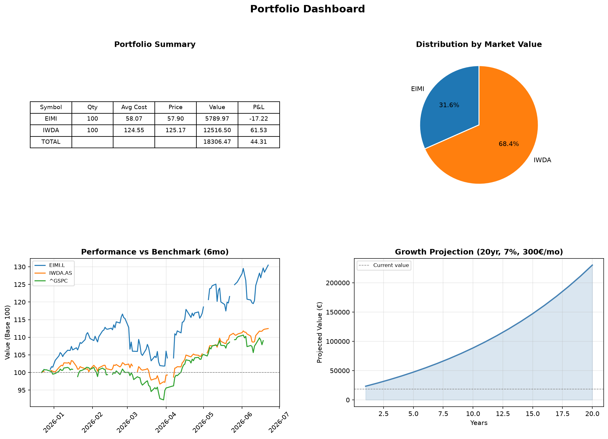
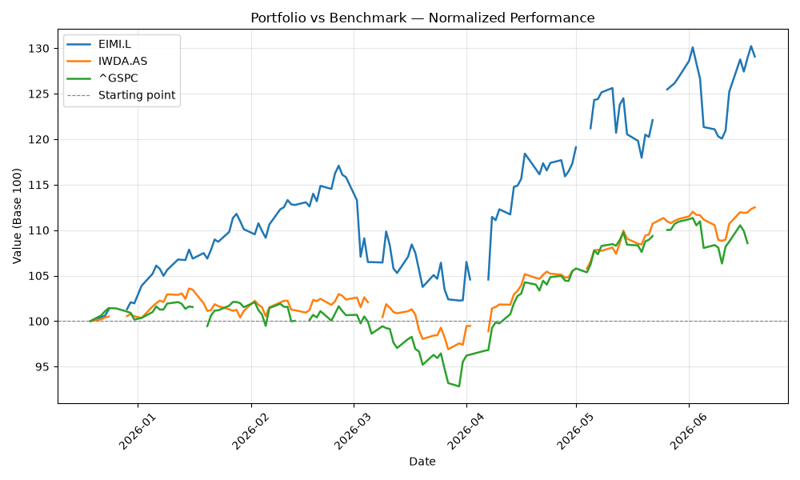

# 📊 ibkr-portfolio-analyzer

A command-line tool that connects to Interactive Brokers via API to analyze
your real portfolio — summary, performance vs benchmark, growth projections,
and a full visual dashboard.


---

## ✨ Features

- 🔌 Live connection to Interactive Brokers via `ib_async`
- 📋 Portfolio summary with market value and unrealized P&L
- 📈 Performance chart vs benchmark (normalized base 100)
- 🥧 Portfolio distribution pie chart
- 🔮 Compound interest growth projection with configurable parameters
- 📊 Full dashboard combining all views in one image

---

## ⚙️ Requirements

- Python 3.14+
- Interactive Brokers account (real or paper trading)
- Trader Workstation (TWS) running locally with API enabled on port 7497

---

## 🚀 Installation

**1. Clone the repository**
```bash
git clone https://github.com/david-deluca/ibkr-portfolio-analyzer.git
cd ibkr-portfolio-analyzer
```

**2. Install dependencies**
```bash
pip install -r requirements.txt
```

**3. Configure TWS**
- Open Trader Workstation and log in
- Go to File → Global Configuration → API → Settings
- Enable "ActiveX and Socket Clients"
- Set Socket Port to `7497`
- Click Apply → OK

---

## 📋 Usage

> **Note:** TWS must be running and logged in before executing any command.

**Portfolio summary with P&L:**
```bash
python main.py --summary
```

**Performance chart vs benchmark:**
```bash
python main.py --performance
```

**Portfolio distribution pie chart:**
```bash
python main.py --distribution
```

**Growth projection (default: 300€/mo, 7%, 20 years):**
```bash
python main.py --projection
```

**Customize projection parameters:**
```bash
python main.py --projection --monthly 500 --return-rate 0.08 --years 30
```

**Full dashboard (all views combined):**
```bash
python main.py --dashboard
```

---

## 📸 Demo

**Portfolio summary:**
```
======================================================================
PORTFOLIO SUMMARY
======================================================================
Symbol   |    Qty |  Avg Cost |    Price |      Value |      P&L
----------------------------------------------------------------------
EIMI     |  100.0 |     58.07 |    57.90 |    5789.97 |   -17.22
IWDA     |  100.0 |    124.55 |   125.17 |   12516.50 |    61.53
----------------------------------------------------------------------
TOTAL    |        |           |          |   18306.47 |    44.31
======================================================================
```
**Dashboard:**



**Performance chart:**



---

## 📁 Project Structure
ibkr-portfolio-analyzer/

├── main.py                  # Entry point — CLI interface

├── src/

│   ├── connector.py         # IBKR API connection via ib_async

│   ├── portfolio.py         # Portfolio summary and distribution

│   ├── benchmark.py         # Historical data and performance metrics

│   ├── benchmark_plot.py    # Performance line chart

│   ├── projection.py        # Compound interest growth projection

│   └── dashboard.py         # Full 4-panel dashboard

├── data/

├── output/

│   ├── dashboard.png        # Generated dashboard (auto-generated)

│   ├── performance.png      # Generated performance chart

│   └── distribution.png     # Generated pie chart

├── requirements.txt

└── README.md

---

## 🗺️ Roadmap

- [x] Live IBKR API connection
- [x] Portfolio summary with P&L
- [x] Performance vs benchmark chart
- [x] Portfolio distribution pie chart
- [x] Compound interest growth projection
- [x] Full portfolio dashboard
- [ ] Unit tests with pytest
- [ ] Export summary report to PDF
- [ ] Support for multiple accounts

---

## ⚠️ Disclaimer

This tool is for personal use and educational purposes only.
It does not constitute financial advice.
Past performance is not indicative of future results.

---

## 📄 License

MIT License — see [LICENSE](LICENSE) for details.